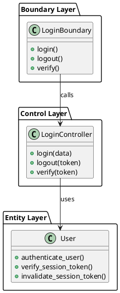

# CSR Application - Complete BCE Class Diagrams Documentation

## 📋 Table of Contents
1. [Overview](#overview)
2. [BCE Architecture Pattern](#bce-architecture-pattern)
3. [Complete Class Diagrams by Module](#complete-class-diagrams-by-module)
   - [Authentication Module](#authentication-module)
   - [User Account Management](#user-account-management)
   - [User Profile Management](#user-profile-management)
   - [Role Management](#role-management)
   - [Request Management (PIN)](#request-management-pin)
   - [Shortlist Management (CSR)](#shortlist-management-csr)
4. [Cross-Module Relationships](#cross-module-relationships)
5. [Database Schema Mapping](#database-schema-mapping)

---

## 🏗️ Overview

This CSR (Corporate Social Responsibility) application follows a **2-layer BCE (Boundary-Control-Entity)** architecture pattern, which is a variant of the traditional 3-tier architecture commonly used in software engineering education and enterprise applications.

### System Architecture Layers

```
┌─────────────────────────────────────────────────────────┐
│                    PRESENTATION LAYER                    │
│         (Next.js React Frontend - Not in BCE)            │
└────────────────────┬────────────────────────────────────┘
                     │ HTTP/REST API
┌────────────────────▼────────────────────────────────────┐
│                   BOUNDARY LAYER (B)                     │
│         HTTP Request/Response Handling (Flask)           │
│      - Routing, Validation, Error Handling               │
│      - JWT Authentication & Authorization                │
└────────────────────┬────────────────────────────────────┘
                     │ Method Calls
┌────────────────────▼────────────────────────────────────┐
│                   CONTROL LAYER (C)                      │
│              Business Logic (Python)                     │
│      - Data Processing, Validation                       │
│      - Business Rules Enforcement                        │
└────────────────────┬────────────────────────────────────┘
                     │ Database Operations
┌────────────────────▼────────────────────────────────────┐
│                    ENTITY LAYER (E)                      │
│           Data Access Layer (Python + Supabase)          │
│      - CRUD Operations, Queries                          │
│      - Database Connection Management                    │
└────────────────────┬────────────────────────────────────┘
                     │ SQL Queries
┌────────────────────▼────────────────────────────────────┐
│                    DATABASE LAYER                        │
│           Supabase (PostgreSQL)                          │
└─────────────────────────────────────────────────────────┘
```

---

## 🎯 BCE Architecture Pattern

### Boundary Layer (B)
**Purpose**: Handle HTTP communication between client and server

**Responsibilities**:
- Parse HTTP requests (JSON, query params, path params)
- Validate request format and authentication
- Call appropriate Control layer methods
- Format responses (success/error JSON)
- HTTP status code management

**Technologies**: Flask Blueprints, Python decorators

**Location**: `src/controller/*/boundary/*.py`

### Control Layer (C)
**Purpose**: Implement business logic and rules

**Responsibilities**:
- Business rule validation
- Data transformation and processing
- Orchestrate Entity layer operations
- Error handling and logging
- Token verification
- Cross-entity coordination

**Technologies**: Python classes and static methods

**Location**: `src/controller/*/*.py` (controller files)

### Entity Layer (E)
**Purpose**: Manage data persistence and retrieval

**Responsibilities**:
- Direct database operations (CRUD)
- SQL query construction
- Data model representation
- Relationship management
- Connection pooling

**Technologies**: Python classes, Supabase client

**Location**: `src/entity/*.py`

---

## 📦 Complete Class Diagrams by Module

### 1. Authentication Module

#### Class Diagram
```
┌─────────────────────────────────────────────────────────────────┐
│                        BOUNDARY LAYER                            │
├─────────────────────────────────────────────────────────────────┤
│  LoginBoundary (Blueprint)                                       │
│  File: src/controller/auth/boundary/login_boundary.py            │
├─────────────────────────────────────────────────────────────────┤
│  + POST /api/auth/login                                          │
│  + POST /api/auth/logout                                         │
│  + GET /api/auth/verify                                          │
├─────────────────────────────────────────────────────────────────┤
│  Methods:                                                        │
│  + login() → (JSON, status_code)                                 │
│  + logout() → (JSON, status_code)                                │
│  + verify_token() → (JSON, status_code)                          │
└───────────────────────────┬─────────────────────────────────────┘
                            │ calls
┌───────────────────────────▼─────────────────────────────────────┐
│                        CONTROL LAYER                             │
├─────────────────────────────────────────────────────────────────┤
│  LoginController                                                 │
│  File: src/controller/auth/login_controller.py                   │
├─────────────────────────────────────────────────────────────────┤
│  Static Methods:                                                 │
│  + login(data: dict) → (dict, int)                               │
│  + logout(token: str) → (dict, int)                              │
│  + verify(token: str) → (dict, int)                              │
├─────────────────────────────────────────────────────────────────┤
│  Helper Methods:                                                 │
│  + extract_and_sanitize_auth_data(data: dict) → dict             │
└───────────────────────────┬─────────────────────────────────────┘
                            │ uses
┌───────────────────────────▼─────────────────────────────────────┐
│                        ENTITY LAYER                              │
├─────────────────────────────────────────────────────────────────┤
│  User                                                            │
│  File: src/entity/user.py                                        │
├─────────────────────────────────────────────────────────────────┤
│  Static Methods:                                                 │
│  + authenticate_user(username, password, role_name) → dict       │
│  + verify_session_token(token: str) → dict                       │
│  + invalidate_session_token(token: str) → bool                   │
│  + log_user_activity(user_id, action, details) → None            │
├─────────────────────────────────────────────────────────────────┤
│  Database Table: users                                           │
│  - id, username, password, email, full_name, role_id             │
└───────────────────────────┬─────────────────────────────────────┘
                            │ queries
                            ▼
                    [Supabase Database]
```

#### Key Attributes & Methods

**LoginBoundary**
- Decorators: `@login_boundary.route()`
- Request handlers for login, logout, verify
- Extracts JWT tokens from Authorization header

**LoginController**
- `login(data)`: Validates credentials, generates JWT token
- `logout(token)`: Invalidates session token
- `verify(token)`: Checks if token is valid and active
- Uses: `Validators`, `Sanitizers`, `TokenHelpers`, `ResponseHelpers`

**User Entity**
- `authenticate_user()`: Checks username/password/role match
- `verify_session_token()`: Decodes JWT and validates user exists
- `invalidate_session_token()`: Marks session as invalid (if session table exists)
- Uses: `werkzeug.security` for password hashing, `PyJWT` for tokens

---

### 2. User Account Management

#### Class Diagram
```
┌─────────────────────────────────────────────────────────────────┐
│                        BOUNDARY LAYER                            │
├─────────────────────────────────────────────────────────────────┤
│  CreateUserAccountBoundary                                       │
│  File: boundary/create_user_account_boundary.py                  │
│  + POST /api/users                                               │
├─────────────────────────────────────────────────────────────────┤
│  ViewUserAccountBoundary                                         │
│  File: boundary/view_user_account_boundary.py                    │
│  + GET /api/users                                                │
│  + GET /api/users/{id}                                           │
├─────────────────────────────────────────────────────────────────┤
│  UpdateUserAccountBoundary                                       │
│  File: boundary/update_user_account_boundary.py                  │
│  + PUT /api/users/{id}                                           │
├─────────────────────────────────────────────────────────────────┤
│  SuspendUserAccountBoundary                                      │
│  File: boundary/suspend_user_account_boundary.py                 │
│  + PATCH /api/users/{id}/suspend                                 │
├─────────────────────────────────────────────────────────────────┤
│  SearchUserAccountBoundary                                       │
│  File: boundary/search_user_account_boundary.py                  │
│  + GET /api/users/search?q={query}&role={role_id}                │
└───────────────────────────┬─────────────────────────────────────┘
                            │ calls
┌───────────────────────────▼─────────────────────────────────────┐
│                        CONTROL LAYER                             │
├─────────────────────────────────────────────────────────────────┤
│  CreateUserAccountController                                     │
│  + create_user(data: dict) → (dict, int)                         │
├─────────────────────────────────────────────────────────────────┤
│  ViewUserAccountController                                       │
│  + get_all_users(page, limit) → (dict, int)                      │
│  + get_user_by_id(user_id) → (dict, int)                         │
├─────────────────────────────────────────────────────────────────┤
│  UpdateUserAccountController                                     │
│  + update_user(user_id, updates) → (dict, int)                   │
├─────────────────────────────────────────────────────────────────┤
│  SuspendUserAccountController                                    │
│  + suspend_user(user_id) → (dict, int)                           │
│  + activate_user(user_id) → (dict, int)                          │
├─────────────────────────────────────────────────────────────────┤
│  SearchUserAccountController                                     │
│  + search_users(query, filters) → (dict, int)                    │
└───────────────────────────┬─────────────────────────────────────┘
                            │ uses
┌───────────────────────────▼─────────────────────────────────────┐
│                        ENTITY LAYER                              │
├─────────────────────────────────────────────────────────────────┤
│  User                                                            │
│  File: src/entity/user.py                                        │
├─────────────────────────────────────────────────────────────────┤
│  + create_user(username, password, email, full_name, role_id)   │
│  + get_user_by_id(user_id: int) → dict                           │
│  + get_all_users(limit, offset) → list[dict]                     │
│  + update_user(user_id, updates: dict) → bool                    │
│  + suspend_user(user_id: int) → bool                             │
│  + search_users(query: str, filters: dict) → list[dict]          │
│  + check_username_exists(username: str) → bool                   │
│  + check_email_exists(email: str) → bool                         │
└───────────────────────────┬─────────────────────────────────────┘
                            │
                            ▼
                    [users table in Database]
```

#### Database Schema
```sql
CREATE TABLE users (
    id SERIAL PRIMARY KEY,
    username VARCHAR(50) UNIQUE NOT NULL,
    password VARCHAR(255) NOT NULL,
    email VARCHAR(100) UNIQUE NOT NULL,
    full_name VARCHAR(100) NOT NULL,
    role_id INTEGER REFERENCES roles(id),
    is_active BOOLEAN DEFAULT TRUE,
    created_at TIMESTAMP DEFAULT NOW(),
    updated_at TIMESTAMP DEFAULT NOW()
);
```

---

### 3. User Profile Management

#### Class Diagram
```
┌─────────────────────────────────────────────────────────────────┐
│                        BOUNDARY LAYER                            │
├─────────────────────────────────────────────────────────────────┤
│  CreateUserProfileBoundary                                       │
│  + POST /api/profiles                                            │
├─────────────────────────────────────────────────────────────────┤
│  ViewUserProfileBoundary                                         │
│  + GET /api/profiles/{user_id}                                   │
├─────────────────────────────────────────────────────────────────┤
│  UpdateUserProfileBoundary                                       │
│  + PUT /api/profiles/{user_id}                                   │
├─────────────────────────────────────────────────────────────────┤
│  SuspendUserProfileBoundary                                      │
│  + PATCH /api/profiles/{user_id}/suspend                         │
├─────────────────────────────────────────────────────────────────┤
│  SearchUserProfileBoundary                                       │
│  + GET /api/profiles/search?q={query}                            │
└───────────────────────────┬─────────────────────────────────────┘
                            │ calls
┌───────────────────────────▼─────────────────────────────────────┐
│                        CONTROL LAYER                             │
├─────────────────────────────────────────────────────────────────┤
│  CreateUserProfileController                                     │
│  UpdateUserProfileController                                     │
│  ViewUserProfileController                                       │
│  SuspendUserProfileController                                    │
│  SearchUserProfileController                                     │
└───────────────────────────┬─────────────────────────────────────┘
                            │ uses
┌───────────────────────────▼─────────────────────────────────────┐
│                        ENTITY LAYER                              │
├─────────────────────────────────────────────────────────────────┤
│  Profile                                                         │
│  File: src/entity/profile.py                                     │
├─────────────────────────────────────────────────────────────────┤
│  + create_profile(user_id, phone, address, bio) → dict           │
│  + get_profile_by_user_id(user_id: int) → dict                   │
│  + update_profile(user_id, updates: dict) → bool                 │
│  + delete_profile(user_id: int) → bool                           │
└───────────────────────────┬─────────────────────────────────────┘
                            │
                            ▼
                    [user_profiles table]
```

#### Database Schema
```sql
CREATE TABLE user_profiles (
    id SERIAL PRIMARY KEY,
    user_id INTEGER UNIQUE REFERENCES users(id) ON DELETE CASCADE,
    phone VARCHAR(20),
    address TEXT,
    bio TEXT,
    created_at TIMESTAMP DEFAULT NOW(),
    updated_at TIMESTAMP DEFAULT NOW()
);
```

---

### 4. Role Management

#### Class Diagram
```
┌─────────────────────────────────────────────────────────────────┐
│                        BOUNDARY LAYER                            │
├─────────────────────────────────────────────────────────────────┤
│  GetPublicRolesBoundary                                          │
│  + GET /api/roles/public                                         │
├─────────────────────────────────────────────────────────────────┤
│  GetAllRolesBoundary                                             │
│  + GET /api/roles                                                │
├─────────────────────────────────────────────────────────────────┤
│  GetRoleBoundary                                                 │
│  + GET /api/roles/{id}                                           │
├─────────────────────────────────────────────────────────────────┤
│  CreateRoleBoundary                                              │
│  + POST /api/roles                                               │
├─────────────────────────────────────────────────────────────────┤
│  UpdateRoleBoundary                                              │
│  + PUT /api/roles/{id}                                           │
├─────────────────────────────────────────────────────────────────┤
│  DeleteRoleBoundary                                              │
│  + DELETE /api/roles/{id}                                        │
└───────────────────────────┬─────────────────────────────────────┘
                            │ calls
┌───────────────────────────▼─────────────────────────────────────┐
│                        CONTROL LAYER                             │
├─────────────────────────────────────────────────────────────────┤
│  GetPublicRolesController                                        │
│  GetAllRolesController                                           │
│  GetRoleController                                               │
│  CreateRoleController                                            │
│  UpdateRoleController                                            │
│  DeleteRoleController                                            │
└───────────────────────────┬─────────────────────────────────────┘
                            │ uses
┌───────────────────────────▼─────────────────────────────────────┐
│                        ENTITY LAYER                              │
├─────────────────────────────────────────────────────────────────┤
│  Role                                                            │
│  File: src/entity/role.py                                        │
├─────────────────────────────────────────────────────────────────┤
│  + get_all_roles() → list[dict]                                  │
│  + get_role_by_id(role_id: int) → dict                           │
│  + get_role_by_name(role_name: str) → dict                       │
│  + create_role(role_name, role_code, description) → dict         │
│  + update_role(role_id, updates: dict) → bool                    │
│  + delete_role(role_id: int) → bool                              │
└───────────────────────────┬─────────────────────────────────────┘
                            │
                            ▼
                    [roles table]
```

#### Database Schema
```sql
CREATE TABLE roles (
    id SERIAL PRIMARY KEY,
    role_name VARCHAR(50) UNIQUE NOT NULL,
    role_code VARCHAR(20) UNIQUE NOT NULL,
    description TEXT,
    dashboard_route VARCHAR(100),
    created_at TIMESTAMP DEFAULT NOW()
);

-- Default Roles
INSERT INTO roles (role_name, role_code, description, dashboard_route) VALUES
('User Admin', 'USER_ADMIN', 'System administrator', '/admin'),
('PIN', 'PIN', 'Person In Need', '/pin'),
('CSR Rep', 'CSR_REP', 'CSR Representative/Volunteer', '/csr'),
('Platform Management', 'PLATFORM_MGMT', 'Platform management team', '/platform');
```

---

### 5. Request Management (PIN)

#### Class Diagram
```
┌─────────────────────────────────────────────────────────────────┐
│                        BOUNDARY LAYER                            │
├─────────────────────────────────────────────────────────────────┤
│  CreatePinNewRequestBoundary                                     │
│  + POST /api/requests                                            │
├─────────────────────────────────────────────────────────────────┤
│  ViewPinRequestBoundary                                          │
│  + GET /api/requests/{id}                                        │
├─────────────────────────────────────────────────────────────────┤
│  UpdatePinRequestBoundary                                        │
│  + PUT /api/requests/{id}                                        │
├─────────────────────────────────────────────────────────────────┤
│  SuspendPinRequestBoundary                                       │
│  + PATCH /api/requests/{id}/suspend                              │
├─────────────────────────────────────────────────────────────────┤
│  SearchPinRequestBoundary                                        │
│  + GET /api/requests/search?q={query}                            │
├─────────────────────────────────────────────────────────────────┤
│  GetPinRequestsBoundary                                          │
│  + GET /api/requests?status={status}&service_type={type}         │
├─────────────────────────────────────────────────────────────────┤
│  GetRequestAnalyticsBoundary                                     │
│  + GET /api/requests/analytics                                   │
├─────────────────────────────────────────────────────────────────┤
│  IncrementViewCountBoundary                                      │
│  + POST /api/requests/{id}/view                                  │
├─────────────────────────────────────────────────────────────────┤
│  GetCompletedMatchesBoundary                                     │
│  + GET /api/requests/completed-matches                           │
├─────────────────────────────────────────────────────────────────┤
│  GetRequestLookupsBoundary                                       │
│  + GET /api/requests/service-types                               │
└───────────────────────────┬─────────────────────────────────────┘
                            │ calls
┌───────────────────────────▼─────────────────────────────────────┐
│                        CONTROL LAYER                             │
├─────────────────────────────────────────────────────────────────┤
│  CreatePinNewRequestController                                   │
│  + create_request(data: dict, token: str) → (dict, int)          │
├─────────────────────────────────────────────────────────────────┤
│  ViewPinRequestController                                        │
│  + get_request(request_id: int) → (dict, int)                    │
├─────────────────────────────────────────────────────────────────┤
│  UpdatePinRequestController                                      │
│  + update_request(id, data, token) → (dict, int)                 │
├─────────────────────────────────────────────────────────────────┤
│  SearchPinRequestController                                      │
│  + search_requests(query, filters) → (dict, int)                 │
├─────────────────────────────────────────────────────────────────┤
│  GetRequestAnalyticsController                                   │
│  + get_analytics(user_id) → (dict, int)                          │
└───────────────────────────┬─────────────────────────────────────┘
                            │ uses
┌───────────────────────────▼─────────────────────────────────────┐
│                        ENTITY LAYER                              │
├─────────────────────────────────────────────────────────────────┤
│  Request                                                         │
│  File: src/entity/request.py                                     │
├─────────────────────────────────────────────────────────────────┤
│  + create_request(pin_user_id, title, description, ...) → dict   │
│  + get_request_by_id(request_id: int) → dict                     │
│  + get_all_requests(filters, limit, offset) → list[dict]         │
│  + update_request(request_id, updates: dict) → bool              │
│  + suspend_request(request_id: int) → bool                       │
│  + search_requests(query: str, filters: dict) → list[dict]       │
│  + increment_view_count(request_id: int) → bool                  │
│  + increment_shortlist_count(request_id: int) → bool             │
│  + decrement_shortlist_count(request_id: int) → bool             │
└───────────────────────────┬─────────────────────────────────────┘
                            │
                            ▼
                    [requests table]
```

#### Database Schema
```sql
CREATE TABLE requests (
    id SERIAL PRIMARY KEY,
    pin_user_id INTEGER REFERENCES users(id) ON DELETE CASCADE,
    title VARCHAR(200) NOT NULL,
    description TEXT NOT NULL,
    service_type VARCHAR(50) NOT NULL,
    region VARCHAR(100),
    requested_by_date DATE,
    status VARCHAR(20) DEFAULT 'ACTIVE',
    image_url VARCHAR(500),
    view_count INTEGER DEFAULT 0,
    shortlist_count INTEGER DEFAULT 0,
    is_archived BOOLEAN DEFAULT FALSE,
    suspended_at TIMESTAMP,
    fulfilled_at TIMESTAMP,
    created_at TIMESTAMP DEFAULT NOW(),
    updated_at TIMESTAMP DEFAULT NOW()
);

-- Indexes
CREATE INDEX idx_requests_pin_user ON requests(pin_user_id);
CREATE INDEX idx_requests_status ON requests(status);
CREATE INDEX idx_requests_service_type ON requests(service_type);
```

---

### 6. Shortlist Management (CSR)

#### Class Diagram
```
┌─────────────────────────────────────────────────────────────────┐
│                        BOUNDARY LAYER                            │
├─────────────────────────────────────────────────────────────────┤
│  AddToShortlistBoundary                                          │
│  + POST /api/shortlist                                           │
├─────────────────────────────────────────────────────────────────┤
│  GetShortlistBoundary                                            │
│  + GET /api/shortlist?status={status}&page={page}                │
├─────────────────────────────────────────────────────────────────┤
│  UpdateShortlistStatusBoundary                                   │
│  + PATCH /api/shortlist/{id}/status                              │
├─────────────────────────────────────────────────────────────────┤
│  RemoveFromShortlistBoundary                                     │
│  + DELETE /api/shortlist/{id}                                    │
├─────────────────────────────────────────────────────────────────┤
│  GetShortlistStatsBoundary                                       │
│  + GET /api/shortlist/stats                                      │
└───────────────────────────┬─────────────────────────────────────┘
                            │ calls
┌───────────────────────────▼─────────────────────────────────────┐
│                        CONTROL LAYER                             │
├─────────────────────────────────────────────────────────────────┤
│  AddToShortlistController                                        │
│  + add_shortlist(auth_token, data) → (dict, int)                 │
├─────────────────────────────────────────────────────────────────┤
│  GetShortlistController                                          │
│  + get_shortlist(token, status, page, limit) → (dict, int)       │
├─────────────────────────────────────────────────────────────────┤
│  UpdateShortlistStatusController                                 │
│  + update_status(token, id, status, notes, hours) → (dict, int)  │
├─────────────────────────────────────────────────────────────────┤
│  RemoveFromShortlistController                                   │
│  + remove_shortlist(token, shortlist_id) → (dict, int)           │
├─────────────────────────────────────────────────────────────────┤
│  GetShortlistStatsController                                     │
│  + get_stats(token) → (dict, int)                                │
└───────────────────────────┬─────────────────────────────────────┘
                            │ uses
┌───────────────────────────▼─────────────────────────────────────┐
│                        ENTITY LAYER                              │
├─────────────────────────────────────────────────────────────────┤
│  Shortlist                                                       │
│  File: src/entity/shortlist.py                                   │
├─────────────────────────────────────────────────────────────────┤
│  + add_to_shortlist(csr_user_id, request_id, notes) → dict       │
│  + search_shortlist(csr_user_id, status, limit, offset) → list   │
│  + update_shortlist_status(id, user_id, status, ...) → bool      │
│  + remove_from_shortlist(shortlist_id, csr_user_id) → bool       │
│  + get_shortlist_stats(csr_user_id) → dict                       │
│  + check_already_shortlisted(csr_user_id, request_id) → bool     │
└───────────────────────────┬─────────────────────────────────────┘
                            │
                            ▼
                    [shortlist table]
```

#### Database Schema
```sql
CREATE TABLE shortlist (
    id SERIAL PRIMARY KEY,
    csr_user_id INTEGER REFERENCES users(id) ON DELETE CASCADE,
    request_id INTEGER REFERENCES requests(id) ON DELETE CASCADE,
    status VARCHAR(20) DEFAULT 'SHORTLISTED',
    notes TEXT,
    volunteered_hours DECIMAL(5,2),
    completion_date TIMESTAMP,
    feedback_from_pin TEXT,
    shortlisted_at TIMESTAMP DEFAULT NOW(),
    updated_at TIMESTAMP DEFAULT NOW(),
    
    UNIQUE(csr_user_id, request_id)
);

-- Indexes
CREATE INDEX idx_shortlist_csr_user ON shortlist(csr_user_id);
CREATE INDEX idx_shortlist_request ON shortlist(request_id);
CREATE INDEX idx_shortlist_status ON shortlist(status);
```

---

## 🔗 Cross-Module Relationships

### Entity Relationships
```
roles (1) ──────< (M) users
users (1) ──────< (M) requests (as PIN)
users (1) ──────< (M) shortlist (as CSR)
requests (1) ────< (M) shortlist
users (1) ──────(1) user_profiles
```

### Dependency Flow
```
Boundary Layer
    │
    ├─> Control Layer
    │       │
    │       ├─> Entity Layer (User)
    │       ├─> Entity Layer (Request)
    │       ├─> Entity Layer (Shortlist)
    │       ├─> Entity Layer (Role)
    │       └─> Entity Layer (Profile)
    │
    └─> Utilities
            ├─> Validators
            ├─> Sanitizers
            ├─> TokenHelpers
            ├─> ResponseHelpers
            └─> RequestHelpers
```

---

## 🗄️ Complete Database Schema Mapping

### Entity-to-Table Mapping
| Entity Class | Database Table | Primary Key | Foreign Keys |
|--------------|----------------|-------------|--------------|
| User         | users          | id          | role_id → roles(id) |
| Role         | roles          | id          | None |
| Profile      | user_profiles  | id          | user_id → users(id) |
| Request      | requests       | id          | pin_user_id → users(id) |
| Shortlist    | shortlist      | id          | csr_user_id → users(id), request_id → requests(id) |

### Complete Database ERD
```
┌─────────────────┐
│     roles       │
│─────────────────│
│ PK: id          │
│ role_name       │
│ role_code       │
│ description     │
│ dashboard_route │
└────────┬────────┘
         │ 1
         │
         │ M
┌────────▼────────┐         ┌─────────────────┐
│     users       │ 1     1 │  user_profiles  │
│─────────────────│─────────│─────────────────│
│ PK: id          │         │ PK: id          │
│ username        │         │ FK: user_id     │
│ password        │         │ phone           │
│ email           │         │ address         │
│ full_name       │         │ bio             │
│ FK: role_id     │         └─────────────────┘
│ is_active       │
└────┬────────┬───┘
     │ 1      │ 1
     │ M      │ M
     │        │
     │        │
┌────▼────────▼───────┐      ┌─────────────────┐
│    requests         │ 1  M │   shortlist     │
│─────────────────────│──────│─────────────────│
│ PK: id              │      │ PK: id          │
│ FK: pin_user_id     │      │ FK: csr_user_id │
│ title               │      │ FK: request_id  │
│ description         │      │ status          │
│ service_type        │      │ notes           │
│ region              │      │ volunteered_hrs │
│ requested_by_date   │      │ shortlisted_at  │
│ status              │      └─────────────────┘
│ image_url           │
│ view_count          │
│ shortlist_count     │
└─────────────────────┘
```

---

## 📊 Class Relationships Summary

### Inheritance
- No inheritance in this BCE architecture (composition over inheritance)

### Composition
- Controllers compose Entity methods
- Boundaries compose Controller methods
- Entities compose Supabase client

### Dependencies
```python
# Boundary depends on Control
from controller.auth.login_controller import LoginController

# Control depends on Entity
from entity.user import User
from entity.role import Role

# Control depends on Utilities
from utils.validators import Validators
from utils.helpers import TokenHelpers, ResponseHelpers
```

### Utility Classes
```
┌────────────────────────────────────────┐
│        Utility Classes (Shared)        │
├────────────────────────────────────────┤
│ Validators                             │
│  + validate_email(email) → (bool, str) │
│  + validate_username(str) → (bool, str)│
│  + validate_password(str) → (bool, str)│
├────────────────────────────────────────┤
│ Sanitizers                             │
│  + sanitize_string(text) → str         │
│  + sanitize_username(text) → str       │
│  + sanitize_html(text) → str           │
├────────────────────────────────────────┤
│ TokenHelpers                           │
│  + generate_jwt(user_id) → str         │
│  + decode_jwt(token) → dict            │
├────────────────────────────────────────┤
│ ResponseHelpers                        │
│  + success_response(data) → dict       │
│  + error_response(msg) → dict          │
├────────────────────────────────────────┤
│ RequestHelpers                         │
│  + validate_required_fields() → bool   │
│  + extract_pagination() → (int, int)   │
└────────────────────────────────────────┘
```

---

## 🎨 UML Notation Legend

```
┌─────────────────┐
│   Class Name    │
├─────────────────┤  ← Separator
│ + public method │
│ - private field │
│ # protected     │
└─────────────────┘

─────>  Dependency (uses)
═════>  Inheritance (is-a)
◇───>   Aggregation (has-a)
◆───>   Composition (owns)
```

---

## 📝 Notes for Diagram Creation

### Recommended Tools
1. **Draw.io (diagrams.net)** - Free, web-based
2. **Lucidchart** - Professional, collaborative
3. **PlantUML** - Text-based, version-controllable
4. **Mermaid** - Markdown-based diagrams

### PlantUML Example


---

**Document Version**: 1.0  
**Last Updated**: November 8, 2025  
**Purpose**: Complete BCE Class Diagram documentation for CSR Application


